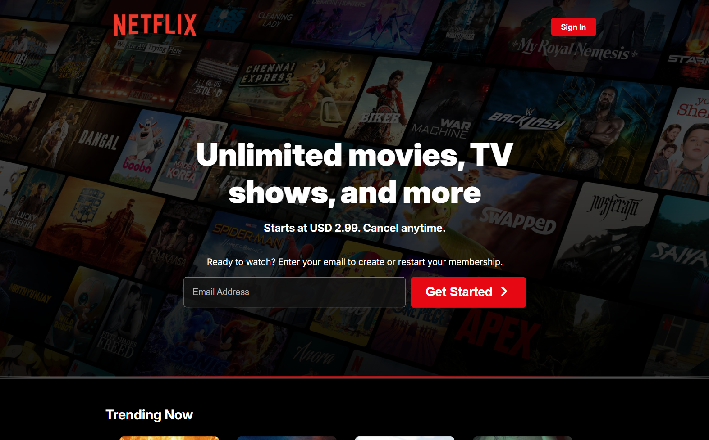

<h1 align="center">🎬 Netflix Clone</h1>

**Started:** 18 May 2026  
**Last Updated:** 23 May 2026

A modern and responsive Netflix clone built using only **HTML** and **CSS**.  
This project focuses on a sleek UI, cinematic layout, and a polished streaming-style experience without JavaScript or a backend.

---

## ✨ Features

- 📱 Responsive Netflix-style layout.
- 🎬 Hero section with featured content.
- 🖼️ Movie and TV show rows.
- 💫 Smooth hover effects on posters and buttons.
- 🧭 Clean navigation bar and footer design.
- 🎨 Fully built with HTML and CSS only.
- ⚡ Easy to customize for personal projects.

---

## 🛠️ Technologies Used

| Technology | Usage                 |
| ---------- | --------------------- |
| HTML       | Structure and content |
| CSS        | Styling and layout    |

---

## 📁 Project Structure

```text
netflix-clone/          # Project Name
├── assets/             # Non-Code Files
│   ├── images/         # Images & Icons
├── README.md           # Project Documentations
├── index.html          # HTML Codes
└── style.css           # CSS Codes
```

---

## 🎯 Usage

- Open the homepage in a browser.
- Explore the hero banner, categories, and movie sections.
- Resize the browser to see the responsive layout in action.
- Use it as a learning project or as a base for future frontend builds.

---

## 🧠 What I Learned

- Creating structured layouts with HTML.
- Styling responsive components with CSS.
- Building a visually appealing streaming-style interface.
- Organizing a frontend project for maintainability.

---

## 🖼️ Screenshot

<p align="center">
    <h4>1. Phone Screen:</h4>
    
</p>

<p align="center">
    <h4>2. Tab Screen:</h4>
    
</p>

<p align="center">
    <h4>3. Laptop or Desktop Screen:</h4>
    
</p>

---

## 🤝 Contributing

Contributions are welcome.  
If you want to improve the design or fix issues, feel free to fork the project and submit a pull request.

---

## 🙌 Acknowledgements

- Inspired by the Netflix UI.
- Built as a frontend practice project using HTML and CSS.

---

## 🌐 Live Demo

You can check out the live preview of this project by clicking the link below:

▶️ [Live Preview](https://dipu-ray.github.io/netflix-clone/)

---

<div align="center">

Made with ❤️ and pure CSS <br>
⭐ If you like this project, feel free to give it a star!

</div>
